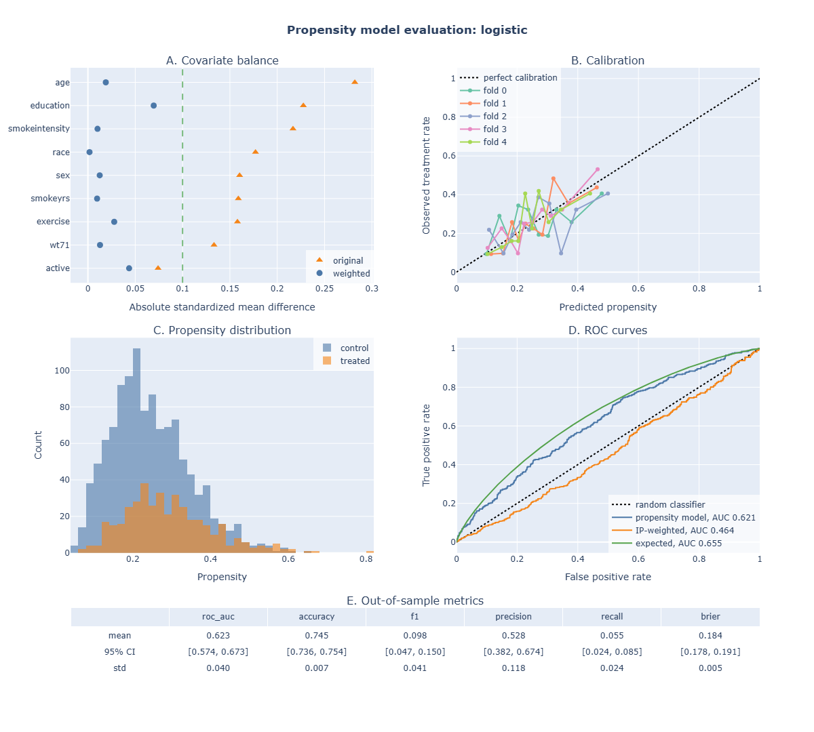
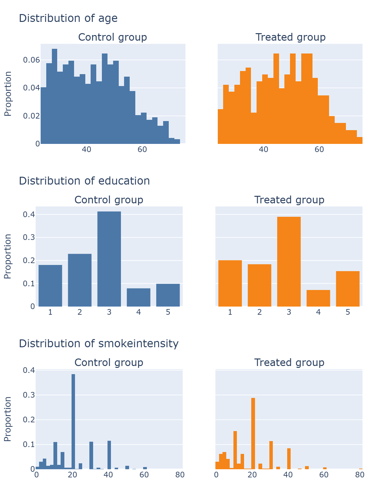
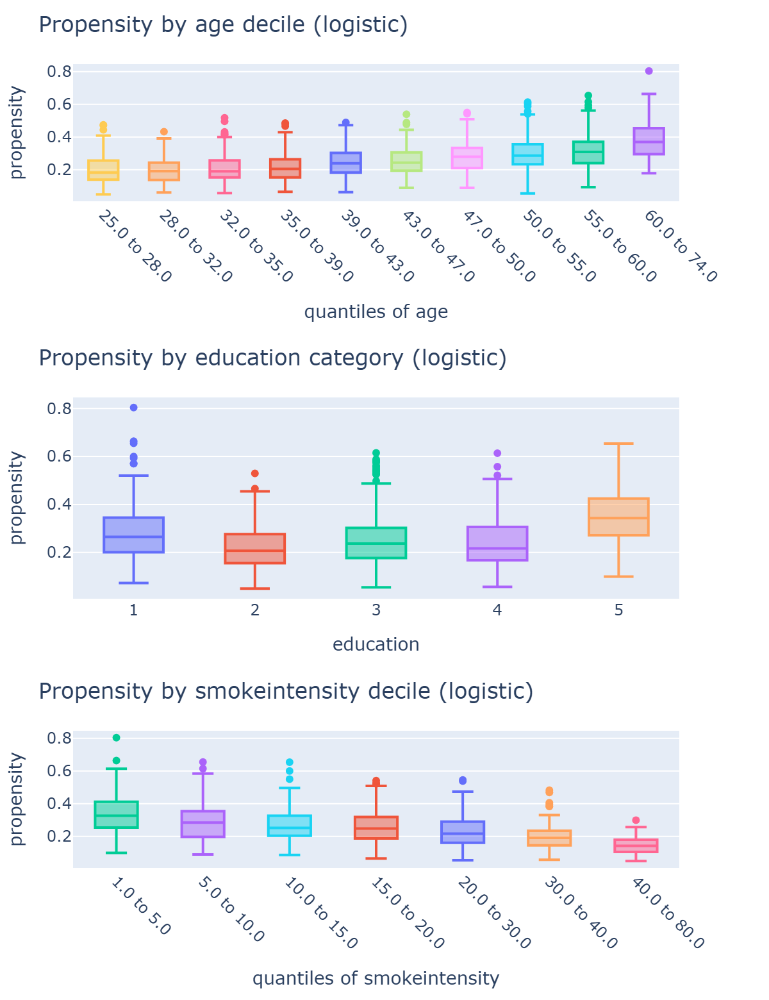

# causaleval

Tools to evaluate propensity models used for causal inference on observational data. This package implements the ideas of [Shimoni et al., *An Evaluation Toolkit to Guide Model Selection and Cohort Definition in Causal Inference* (2019)](https://arxiv.org/abs/1906.00442), which evaluates these observable properties: covariate balance before and after weighting, calibration, propensity overlap, and ROC curves adapted to propensity models (IP-weighted and expected ROC curves).

A propensity model estimates the probability of receiving a treatment given the covariates, P(T=1 | X). The model in itself is not directly used, but its predictions are used downstream often as inverse propensity weights, to remove confounding and estimate a treatment effect.

By definition, propensity models cannot be selected on predictive metrics: the true propensity is never observed, and neither is the causal effect. Causal inference relies on the positivity assumption (among others): for every profile of covariates, individuals must have a non-zero probability of being treated and of not being treated, so that treated and untreated individuals overlap and can be compared. A model that separates treated and control very well signals a lack of overlap. This can be a real feature of the data, calling for a narrower cohort definition, or a modeling flaw (overfitting, or variables that predict treatment but not outcome). Therefore, a better AUC (or accuracy, F1 score...) does not mean a better propensity model. On the contrary, it can be a warning sign. But a low AUC does not validate the model either: it says nothing about unmeasured confounders. In a randomized experiment, the best possible propensity model has an AUC of 0.5.

This package helps evaluating what the propensities do (covariate balance after weighting, calibration and overlap). Good propensities balance the covariates once the data is weighted, are calibrated (their values are used directly, not only their ranking), and leave enough overlap between treated and control.

## Installation

```bash
pip install git+https://github.com/AlxClt/causal-eval
```

To run the tests from a clone:

```bash
pip install -e ".[test]"
pytest
```

## Usage

```python
from causaleval import plot_propensity_evaluation

# data: one row per sample with the treatment ('treated', 0/1), the covariates,
# the predicted propensity ('propensity') and the inverse propensity weight ('ip_weight')
# metrics_summary (optional): out-of-sample metrics shown in a table below the plot,
# one row per metric with columns 'mean', 'ci_low', 'ci_high' (and optionally 'std')
fig = plot_propensity_evaluation(data, continuous=["age"], categoricals=["sex"], fold="fold",
                                 metrics_summary=metrics_summary)
fig.show()
```

Plot functions take a pandas DataFrame and column names, and return plotly figures:

| Function | What it does |
| --- | --- |
| `plot_propensity_evaluation` | The full evaluation in one figure (as Fig. 3 of the paper): the four panels below, plus an optional table of out-of-sample metrics |
| `plot_standardized_differences` | Covariate balance: absolute standardized mean difference of each covariate, in the original and in the weighted data. Weighted values should be below 0.1 |
| `plot_calibration_curves` | Observed treatment rate vs predicted propensity, optionally one curve per cross-validation fold. Curves should follow the diagonal |
| `plot_propensity_distribution` | Propensity histograms of treated and control, to check their overlap |
| `plot_roc_curves` | ROC curves of the propensity model: the model's own curve should be close to the *expected* curve (the one implied by the predicted propensities), and the *IP-weighted* curve close to the diagonal (the weighted data looks randomized) |
| `plot_metrics_summary` | Table of out-of-sample metrics with confidence intervals |
| `plot_confounding_evidence` | Predicted propensity by category, or by quantile for continuous covariates. A trend shows that the covariate drives treatment, i.e. is a candidate confounder |
| `plot_confounder_distributions` | Distribution of each covariate in the control and treated groups |

The values behind the balance and ROC plots are also available, to report them or build custom plots:

| Function | What it does |
| --- | --- |
| `compute_standardized_differences` | Table of absolute standardized mean differences (covariates as rows, one column per dataset). Pass the same data twice with `weights=[None, 'ip_weight']` to compare the original and weighted data |
| `get_propensity_models_roc_curves` | From the treatment and predicted propensity arrays, the inputs of the three ROC curves: `{'vanilla', 'IP_weighted', 'Expected'}`, each `[y_true, y_score, sample_weight]`, to pass to `sklearn.metrics.roc_curve` / `roc_auc_score` |

## Demo

[demo/](demo/) trains and evaluates propensity models end to end.

**Data:** NHEFS, the observational study used in Hernán & Robins, *Causal Inference: What If*. The question is the effect of quitting smoking (`qsmk`) on weight change (`wt82_71`) for 1,566 smokers, 26% of whom quit. The covariates are sex, race, age, education, smoking intensity and years, exercise, activity and baseline weight.

**Training:** three models are compared: logistic regression, random forest, and random forest with sigmoid calibration. Each is trained with 5-fold stratified cross-validation, so every propensity is predicted by a model that didn't see that patient. Out-of-sample ROC AUC, accuracy, F1, precision, recall and Brier score are recorded for each fold.

The evaluation plots of each model, and the confounder plots, are saved in `demo/plots/`. The logistic regression evaluation:



Weighting brings all covariates below the 0.1 threshold (A), the model is reasonably calibrated (B), and treated and control overlap well (C). The modest AUC (about 0.62) is expected: quitting smoking depends only partly on the measured covariates. The IP-weighted AUC slightly below 0.5 (D) indicates that the weights slightly overcorrect.

The confounder plots show where the imbalance comes from: the distribution of each covariate in the control and treated groups (left, `plot_confounder_distributions`), and the predicted propensity across its categories or deciles (right, `plot_confounding_evidence`). The images below are truncated to three covariates; the demo's plots cover all of them. Patients who quit are older, more often in the highest education level, and smoked less: the propensity to quit rises with age and falls with smoking intensity.

<p>
  
  
</p>


The demo downloads the data with [`causaldata`](https://pypi.org/project/causaldata/), which is not a dependency of `causaleval`. To run it:

```bash
git clone https://github.com/AlxClt/causal-eval
cd causal-eval
pip install -e .
pip install causaldata
python demo/propensity_demo.py
```